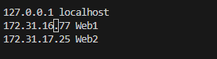
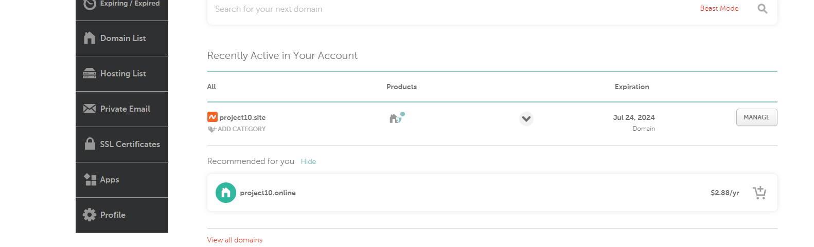
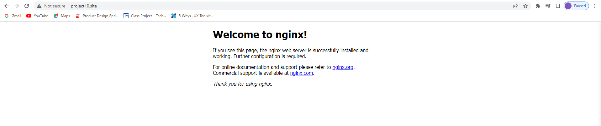
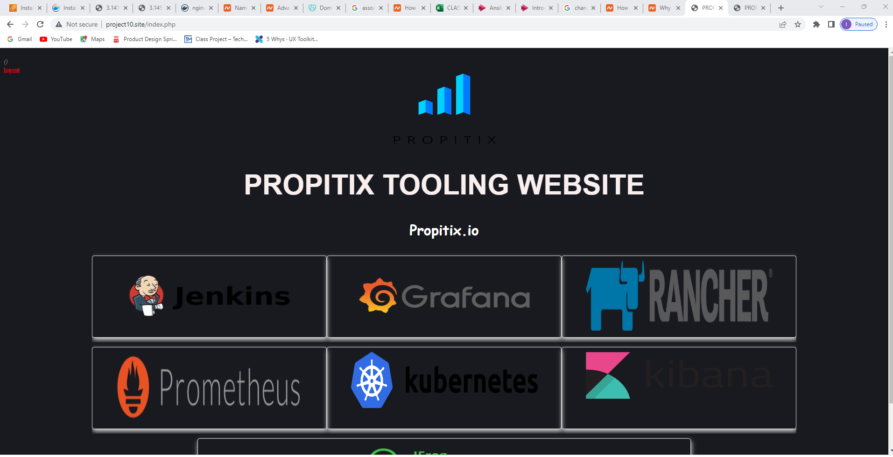
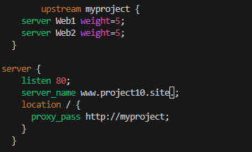
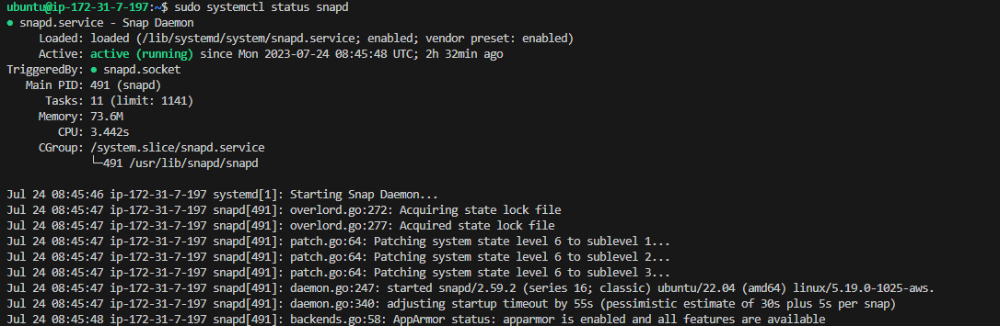
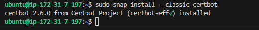

# PROJECT 10 : LOAD BALANCER SOLUTION WITH NGINX AND SSL/TLS

This project consists of two parts:

## Configure Nginx as a Load Balancer

## Register a new domain name and configure secured connection using SSL/TLS certificates

1. Create an EC2 VM based on Ubuntu Server 20.04 LTS and name it Nginx LB (do not forget to open TCP port 80 for HTTP connections, also open TCP port 443 – this port is used for secured HTTPS connections)

2. Install and configure Nginx as a load balancer to point traffic to the resolvable DNS names of the webservers

$ `sudo apt update`

$ `sudo apt install nginx`

2. Update /etc/hosts file for local DNS with Web Servers’ names (e.g. Web1 and Web2) and their local IP addresses

3. Configure Nginx as a load balancer

$ `sudo vi /etc/nginx/nginx.conf`

       #insert following configuration into http section

    upstream myproject {
    server Web1 weight=5;
    server Web2 weight=5;
    }

     server {
    listen 80;
    server_name www.domain.com;
    location / {
      proxy_pass http://myproject;
    }
      }

    #comment out this line
    #       include /etc/nginx/sites-enabled/*;

Restart Nginx and make sure the service is up and running

$ `sudo systemctl restart nginx`

$ `sudo systemctl status nginx`

## REGISTER A NEW DOMAIN NAME AND CONFIGURE SECURED CONNECTION USING SSL/TLS CERTIFICATES

1. Register a new domain name with any registrar of your choice in any domain zone

2. Assign an Elastic IP to your Nginx LB server and associate your domain name with this Elastic IP

3. Update A record in your registrar to point to Nginx LB using Elastic IP address

Check that your Web Servers can be reached from your browser using new domain name using 

     HTTP protocol – http://<your-domain-name.com>

4. Configure Nginx to recognize your new domain name

Update your nginx.conf with server_name www.<your-domain-name.com> instead of server_name www.domain.com

5. Install certbot and request for an SSL/TLS certificate

$ `sudo systemctl status snapd`

$ `sudo snap install --classic certbot`

Request your certificate (just follow the certbot instructions – you will need to choose which domain you want your certificate to be issued for, domain name will be looked up from nginx.conf file so make sure you have updated it)

$ `sudo ln -s /snap/bin/certbot /usr/bin/certbot`

$ `sudo certbot --nginx`

Test secured access to your Web Solution by trying to reach 

      https://<your-domain-name.com>